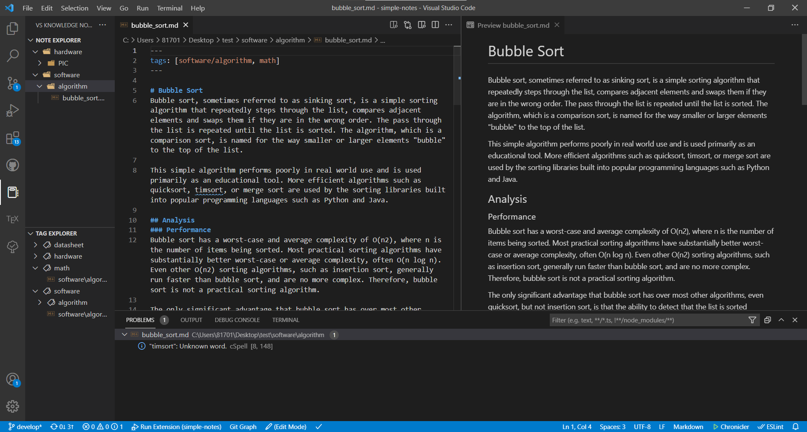
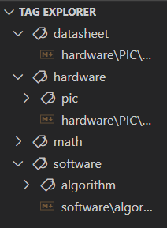
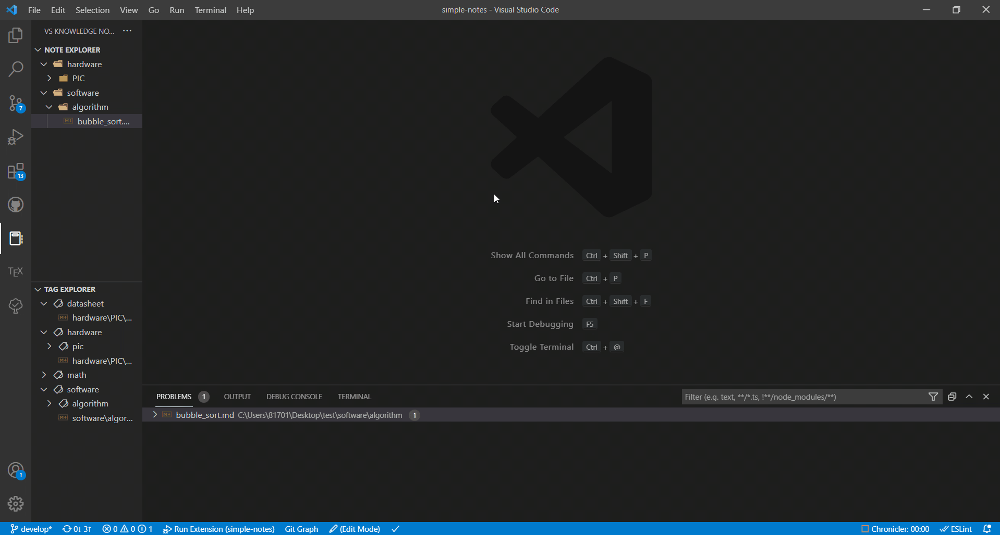

# VS Knowledge Notes
VSCode extension for managing your knowledge.



### Tested at **Windows** only.

# Feature
- Quick access to your knowledge via activity bar.
- Use read-only mode for safely viewing.
- Open markdown as preview by one action when read-only mode.
- Add tags to your note and show tag tree view.
- Search in your notes via command pallette.
### TBA
- Manage revision your note by git.

# Get Started
Execute `VS Knowledge Notes: Set Notes Directory` or click `Set Notes Directory` button on side menu for set note saving directory.

# File Operations

You can operate file in notes directory by GUI, commands and keyboard shortcuts.
## Commands
 - `VS Knowledge Notes: New File`
 - `VS Knowledge Notes: New Folder`
## Keyboard Shortcuts
| Operation        | Shortcut       |
| ---------------- | -------------- |
| findInFolder     | `shift+alt+f`  |
| cut              | `ctrl+x`       |
| copy             | `ctrl+c`       |
| paste            | `ctrl+v`       |
| copyPath         | `shift+alt+c`  |
| copyRelativePath | `ctrl+shift+c` |
| rename           | `f2`           |
| delete           | `delete`       |

Deleted files will be moved to the Trash.

# Display Mode

VS Knowledge Notes has two display mode. You can toggle display mode via statusbar or `VS Knowledge Notes: Toggle Display Mode` command.
## Edit Mode
Edit mode is the same mode as normal vscode, so you can edit file
as you like.
## View Mode
View mode is for reading only. File is added read-only attribute and markdown file is opened as preview.

To preview markdown, you can use vscode standard or [Markdown Preview Enhanced](https://marketplace.visualstudio.com/items?itemName=shd101wyy.markdown-preview-enhanced). See [Settings](#Settings).

# Tags


You can set tags for your notes. The tags you set will be displayed in the side menu.

You can set the tag as follows.

```
---
tags: [software/algorithm, math]
---
```
Tags can be hierarchized by delimiting them with a `/`. The delimiter can be changed freely. See [Settings](#Settings).

# Search

You can search in notes via `VS Knowledge Notes: Search In Notes` command.
Use the button in the upper right for toggling match case, match whole word and use regex.


# Settings
| Name                               | Description                                                                     | type                                |
| ---------------------------------- | ------------------------------------------------------------------------------- | ----------------------------------- |
| `vs-knowledge-notes.notesDir`      | Directory where notes are saved.                                                | string                              |
| `vs-knowledge-notes.confirmDelete` | Controls whether the explorer should ask for confirmation when deleting a file. | boolean                             |
| `vs-knowledge-notes.previewEngine` | Directory where notes are saved.                                                | 'default' \| 'enhanced' \| 'disuse' |
| `vs-knowledge-notes.tagDelimiter`  | A character to delimit tag.                                                     | string                              |
